## Olá, sou o Cauã

Desenvolvedor em início de carreira, com atuação Full Stack na **Arco Tecnologia** e estudante de **Sistemas de Informação na PUC Minas**. Trabalho com Angular, TypeScript, PostgreSQL e Maker (Softwell), desenvolvendo interfaces e funcionalidades para sistemas de gestão.

Gosto de transformar ideias em aplicações úteis e entender como cada parte funciona — da interface ao banco de dados.

**No trabalho:** Angular · TypeScript · PostgreSQL · Maker  
**Nos projetos:** JavaScript · React · Node.js · Express · HTML · CSS · Bootstrap  
**Aprofundando meus estudos:** C# / .NET · SQL · desenvolvimento de APIs

### Projetos selecionados

| Projeto | Proposta | Tecnologias |
| :--- | :--- | :--- |
| [ShotFinder](https://github.com/cauamor-dev/ShotFinder) | Descoberta de filmes e séries por descrições, com informações de títulos e opções de streaming. | React, Node.js, Express, TMDb e Watchmode |
| [PUC News](https://github.com/cauamor-dev/Puc-News) | Portal acadêmico de notícias com busca, favoritos e gerenciamento de conteúdo usando uma API simulada. | JavaScript, Bootstrap, Chart.js e JSON Server |
| [Portfólio](https://github.com/cauamor-dev/Portfolio) | Meu espaço para apresentar projetos, estudos e experiências, com identidade visual inspirada no espaço. | HTML, CSS, JavaScript e Bootstrap |

### Além do código

Sou de Betim, Minas Gerais. Gosto de jogos, animes e ficção científica — especialmente Star Wars e Interestelar. Essa curiosidade também aparece nos meus projetos pessoais.

### Contato

[LinkedIn](https://www.linkedin.com/in/cau%C3%A3-moreira-57a2aa353) · [E-mail](mailto:caua3595@gmail.com)

<strong>English version</strong>

### Hi, I'm Cauã

I'm an early-career software developer working on full-stack development at **Arco Tecnologia** and studying **Information Systems at PUC Minas**. I work with Angular, TypeScript, PostgreSQL, and Maker (Softwell), building interfaces and features for business management systems.

I enjoy turning ideas into useful applications and understanding how each part works, from the interface to the database.

**At work:** Angular · TypeScript · PostgreSQL · Maker  
**In my projects:** JavaScript · React · Node.js · Express · HTML · CSS · Bootstrap  
**Currently studying:** C# / .NET · SQL · API development

### Selected projects

| Project | Purpose | Technologies |
| :--- | :--- | :--- |
| [ShotFinder](https://github.com/cauamor-dev/ShotFinder) | Movie and TV discovery through descriptions, with title information and streaming options. | React, Node.js, Express, TMDb, and Watchmode |
| [PUC News](https://github.com/cauamor-dev/Puc-News) | Academic news portal with search, favorites, and content management using a mock API. | JavaScript, Bootstrap, Chart.js, and JSON Server |
| [Portfolio](https://github.com/cauamor-dev/Portfolio) | A place to share my projects, studies, and experience, with a visual identity inspired by space. | HTML, CSS, JavaScript, and Bootstrap |

### Beyond code

I'm based in Betim, Minas Gerais, Brazil. I enjoy gaming, anime, and science fiction, especially Star Wars and Interstellar. That curiosity also inspires my personal projects.

[LinkedIn](https://www.linkedin.com/in/cau%C3%A3-moreira-57a2aa353) · [Email](mailto:caua3595@gmail.com)

